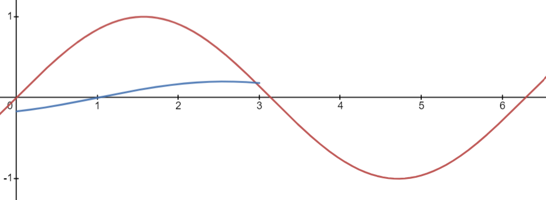
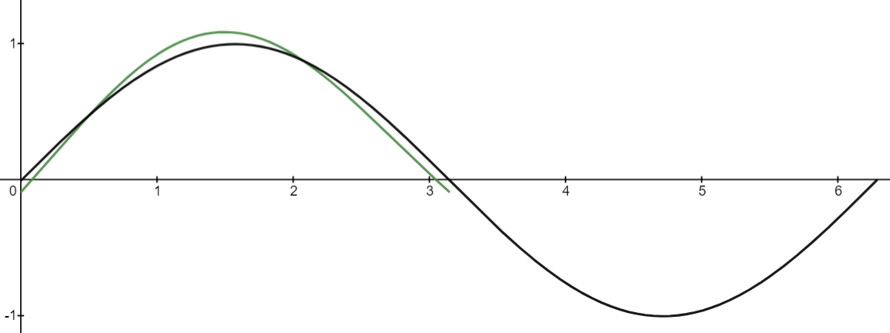

# Audio Steganography: Echo Hiding

Audio Steganography is hiding a message in sounds. We'll mainly look at audio steganography as waves rather than as bits for the sake of explaining the concept of encoding and decoding. We don't want others to hear the encoded message in the original sound, so we will either alter a noisy audio message or use something that humans can't hear.

Some forms of audio steganography:
1. <b>Echo Hiding</b>
    - Hiding data in an echo

2. Spread Spectrum
    - Uses a key that both the encoder and receiver know to "multiply" the message and encode it into the audio file.

3. Phase Coding
    - Frequency shifting

4. Visual Wave Images
    - Hiding data visually in wave graphs of audio
    - Doom did this in their sound track!

5. Least Significant Bit
    - Similar to stegohide

6. Ciphers
    - Examples: morse code, musical cryptograms

## What is Echo Hiding?

Echo hiding is encoding data into audio in the form of echoes that are imperceptible to the human ear. 

It works by creating an echo and adding it to the original sound. 
The echo has several changes to it:
1. The amplitude is lower to conceal the echo.
2. There is an offset to the sound so its phase is different from the original.
3. The decay rate is lowered, making the sound persist for less time.

This picture depicts two sine curves. The green one is the original signal while the blue one is the echo.

The blue curve has a much lower amplitude and persists for less time. It also has a phase shift, but that is hard to tell from the picture.

The message is encoded in sound by making an echo for each "block" of sound. These segments can be arbitrarily divided (i.e. evenly or unevenly).

 </img>

The original block of sound can be shifted by a certain offset to represent 1 or a longer offset to represent 0. Some echo hiding steganography may also represent 0 with no offset at all, meaning there is no echo for that block of sound. The offset can also be negative.

So in order to encode a message, we can split it into binary and create an echo for each fraction of the audio depending on whether the binary is a 0 or a 1. 

In order to decode the message, we can compare the sound file with the echoes with the original sound file to find out where there are actually echoes. This technique is called autocorrelation.

 </img>

The green sine wave is altered with the echo while the black sine wave is just sin(x). By comparing these two we can clearly see some differences from 0 to pi, which will be where the echo is added.

Here is a larger example.

Given the encoded message, we need to find the delay before the echo is produced. Generally humans wouldn't be able to pick it up by ear, but the computer should be able to. But we can still emphasize the echo by finding the "cepstrum."

We can find the cepstrum by using a function transformation. Given that f(x) is the formula for the encoded audio, the cepstrum is $f^{-1}(ln(f(x))^{2})$. And by transforming the encoded audio message like this, we can see the echoes more clearly in a graph and can then determine the peaks of the echo, and autocorrelate it with itself to find which is the most likely delay for '0s' and '1s'.

 </img>

## Echo hiding demo in Audacity
How to echo hide!
1. In order to split the audio, we'll need to create regular intervals by 

[include example audio file]
https://www.youtube.com/watch?v=W-51cjlk2fk
