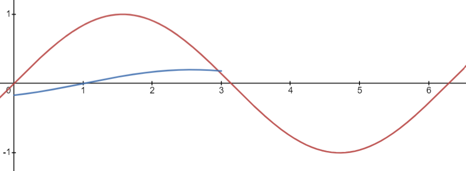

# This document is required.

Audio Steganography is hiding a message in sounds!
Since we're hiding a message in sounds, we probably wouldn;t want the others to hear the encoded message in the original sound, so we either use a noisy audio message or a subtle *

Some forms of audio steganography:
1. Phase Coding
    - Frequency shifting

2. Spread Spectrum
    - Uses a key that both the encoder and receiver know to "multiply" the message and encode it into the audio file.

3. <b>Echo Hiding</b>
    - Hiding data in an echo

4. Visual Wave Images
    - Hiding data visually in wave graphs of audio
    - Doom did this in their sound track!

5. Least Significant Bit
    - Similar to stegohide

6. Ciphers
    - Examples: morse code, musical cryptograms

## What is Echo Hiding?

Echo hiding is encoding data into audio in the form of echoes that are imperceptible to the human ear. 

It works by creating an echo and adding it to the original sound. 
The echo has several changes to it:
1. The amplitude is lower to conceal the echo.
2. There is an offset to the sound so its phase is different from the original.
3. The decay rate is lowered, making the sound persist for less time.

This picture depicts two sine curves. The green one is the original signal while the blue one is the echo.

The blue curve has a much lower amplitude and persists for less time.
It also has a phase shift, but that is hard to tell.

[insert how to get message from blue here]

[how to do your own echo hiding maybe]