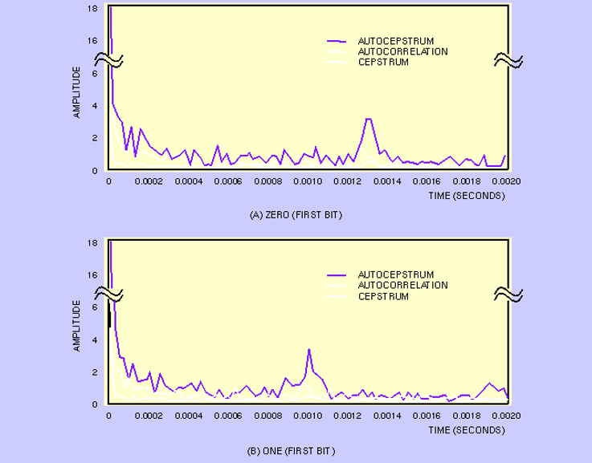

# Audio Steganography: Echo Hiding

 We'll mainly look at audio steganography as waves rather than as bits for the sake of explaining the concept of encoding and decoding.

Some forms of audio steganography:
1. <b>Echo Hiding</b>
    - Hiding data in an echo

2. Spread Spectrum
    - Uses a key that both the encoder and receiver know to "multiply" the message and encode it into the audio file.

3. Phase Coding
    - Frequency shifting

4. Visual Wave Images
    - Hiding data visually in wave graphs of audio
    - Doom did this in their sound track!

5. Least Significant Bit
    - Similar to stegohide

6. Ciphers
    - Examples: morse code, musical cryptograms

## What is Echo Hiding?

Echo hiding is encoding data into audio in the form of echoes that are imperceptible to the human ear.

It works by creating an echo and adding it to the original sound.
The echo has several changes to it:
1. The amplitude is lower to conceal the echo.
2. There is an offset to the sound so its phase is different from the original.
3. The decay rate is lowered, making the sound persist for less time.

 </img>

The message is encoded in sound by making an echo for each "block" of sound. These segments can be arbitrarily divided (i.e. evenly or unevenly).

The original block of sound can be shifted by a certain offset to represent 1 or a longer offset to represent 0. Some echo hiding steganography may also represent 0 with no offset at all, meaning there is no echo for that block of sound. The offset can also be negative.

So in order to encode a message, we can split it into binary and create an echo for each fraction of the audio depending on whether the binary is a 0 or a 1.

## How to decode
In order to decode the message given the original audio file, we can compare the sound file with the echoes with the original sound file to find out where there are actually echoes. This technique is called autocorrelation.

Given the encoded message only, we need to find the delay before the echo is produced. Generally humans wouldn't be able to hear the echo by ear (because of the small delay and amplitude), but the computer should be able to. But we can still emphasize the echo by finding the "cepstrum," which is a graph to analyze periodic structures.

We can find the cepstrum by using a Fourier function transformation. Given that f(x) is the formula for the encoded audio, the cepstrum is $f^{-1}(ln(f(x))^{2})$. And by transforming the encoded audio message like this, we can see the echoes more clearly in a graph and can then determine the peaks of the echo, and autocorrelate it with itself to find which is the most likely delay for '0s' and '1s'.

 </img>

## Echo hiding demo in Audacity

Download this audio file if you want to follow along: [demo.mp3](./Audio/demo.mp3) (click view raw)
(Thanks to Perry for this beautiful audio)

How to echo hide!
1. Highlight the track that you want to split (double click it).

 </img>

2. In order to split the audio, we'll need to create regular intervals by going to `Tools` -> `Regular Interval Labels`.

 </img>

3. A popup should appear with options. For `Create labels based on:`, select `Number of Labels`. This will make the length of the labels only dependent on how many there are. Then type in how many labels you would like. Then for `Adjust label interval to fit length` change the option to `Yes`. Click `Apply`.

 </img>

4. There should be a label created at the bottom with the intervals. Now just cut the audio at the intervals manually with ctrl + i after clicking the part you want to cut.

 </img>

5. For each interval, highlight the interval and go to `Effect` -> `Echo` (or on some versions of audacity `Effect` -> `Delay and Reverb` -> `Echo`). Then select the delay (phase shift) and the decay factor (amplitude). Remember that one delay represents `1` and another delay represents `0` to encode a bit of a message.

 </img>

 </img>

6. Boom, you have audio that has a basic form of echo hiding.

Note: The `Ctrl + r` keyboard shortcut will reproduce the previous transformation onto the highlighted audio clip.

Summary for encoding: `MESSAGE` -> `binary` -> `offset`